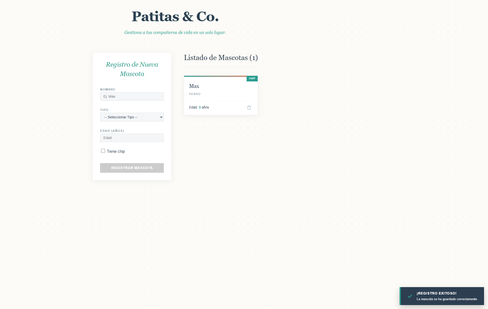

# 🐾 Patitas & Co. - Registro de Mascotas


Una aplicación web moderna y elegante construida con **Angular** para la gestión y registro de mascotas. 



## ✨ Características Principales

### 🛠 Funcionalidades Técnicas
- **Formularios Reactivos (Reactive Forms):** Implementación robusta con `FormBuilder`.
- **Validaciones Personalizadas:**
  - Validaciones estándar (Requerido, Mínimos).
  - **Validador Custom:** `unknownNameValidator` para evitar nombres genéricos como "Desconocido".
  - Feedback visual inmediato (bordes y sombras rojas) en campos inválidos `touched` o `dirty`.
- **Comunicación entre Componentes:**
  - Uso de `@Input` y `@Output` para la gestión de datos entre Padre e Hijo.
  - Emisión de eventos para registro y eliminación de items.
- **Sintaxis Moderna de Angular:** Uso de los nuevos bloques de control de flujo (`@if`, `@for`).
- **Feedback al Usuario:** Notificaciones tipo "Toast" animadas al completar acciones exitosas.

### 🎨 Diseño y UI/UX
- **Diseño "Earth Tones":** Paleta de colores cálida y natural (Arcilla, Verde Naturaleza, Arena).
- **Fondo Texturizado:** Patrón de puntos (Dot Grid) generado con CSS puro.
- **Micro-interacciones:** Animaciones suaves en botones y tarjetas al hacer hover.
- **Diseño Responsivo:** Adaptable a dispositivos móviles y escritorio mediante CSS Grid.

## 🚀 Instalación y Uso

Sigue estos pasos para ejecutar el proyecto en tu entorno local:

1.  **Clonar el repositorio:**
    ```bash
    git clone [https://github.com/Alejandro-Plata/interfaces.git](https://github.com/Alejandro-Plata/interfaces.git)
    cd interfaces/registro-mascotas
    ```

2.  **Instalar dependencias:**
    ```bash
    npm install
    ```

3.  **Ejecutar el servidor de desarrollo:**
    ```bash
    ng serve
    ```

4.  **Abrir en el navegador:**
    Navega a `http://localhost:4200/`.

## 📂 Estructura del Proyecto

El proyecto sigue una arquitectura limpia basada en componentes:

```text
src/
├── app/
│   ├── pet-form/           # Componente del formulario reactivo
│   ├── pet-list/           # Componente para visualizar las tarjetas
│   ├── shared/             # Interfaces (Pet.ts)
│   ├── validaciones/       # Validadores personalizados
│   └── app.component.ts    # Componente principal (Lógica de negocio)
└── styles.css              # Variables CSS globales y estilos base